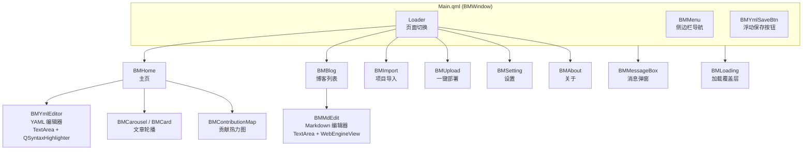
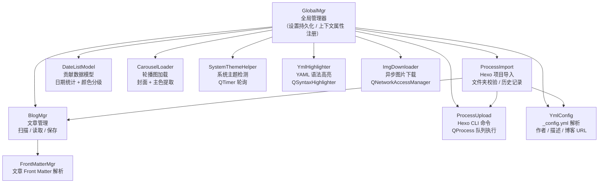
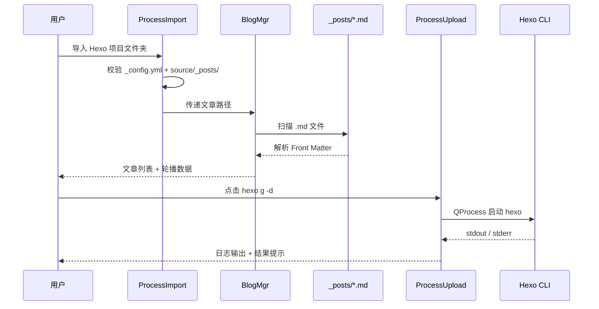

## 🎉简述

基于 **Qt 6.5 + QML** 的 Hexo 博客桌面管理工具，支持导入 GitHub Pages 托管的 Hexo 项目，提供可视化博客管理、Markdown 实时编辑预览、YAML 配置编辑、一键部署等功能。

---

## 🎈特性

- **仪表盘主页** — 轮播展示近期文章、GitHub 风格贡献热力图、作者信息卡片、双栏 YAML 编辑器
- **Markdown 编辑** — 左侧源码编辑、右侧 `WebEngineView` 实时预览，支持一键保存
- **博客管理** — 列表展示全部文章，支持按封面 / 标题 / 日期浏览，快速打开编辑
- **项目管理** — 支持拖拽 / 浏览导入 Hexo 文件夹，历史记录可快速回切
- **YAML 编辑器** — 语法高亮（注释、键名、字符串、布尔值、数字、锚点、标签），亮 / 暗双主题配色
- **一键部署** — 内置 `hexo clean` / `hexo g` / `hexo d` / `hexo s` 等命令，带日志输出面板
- **深色 / 浅色模式** — 支持跟随系统主题自动切换
- **主题颜色** — 内置拾色器，可自定义全局主题色
- **无边框窗口** — 自定义标题栏，支持拖拽移动、四角 / 四边调整窗口大小

---

## 🌳预览

> **主页**


> **博客列表**


> **Markdown 编辑**


> **导入**


> **部署**


> **设置**


> **关于**


---

## 🪄架构

### QML 前端层



### C++ 后端层



### 数据流



### 页面导航

| 页面 | 文件 | 功能 |
|------|------|------|
| 主页 | `page/BMHome.qml` | 轮播图 + 贡献热力图 + 双栏 YAML 编辑 |
| 博客 | `page/BMBlog.qml` | 文章列表，支持编辑 / 跳转部署 |
| 导入 | `page/BMImport.qml` | 拖拽 / 浏览导入 Hexo 项目，历史记录 |
| 部署 | `page/BMUpload.qml` | Hexo CLI 命令按钮 + 日志输出 |
| 设置 | `page/BMSetting.qml` | 深色模式 / 主题色 / 主题 YAML 路径 |
| 关于 | `page/BMAbout.qml` | 作者信息 + 链接 + 动画轮播 |

### 自定义控件

| 控件 | 说明 |
|------|------|
| `BMWindow` | 无边框圆角窗口，支持拖拽移动和缩放 |
| `BMMenu` / `BMMenuButton` | 侧边栏导航菜单 |
| `BMCarousel` / `BMCard` | 博客轮播图，自动轮转 + 悬浮高亮 |
| `BMContributionMap` | GitHub 风格贡献热力图（Canvas 绘制） |
| `BMMdEdit` | Markdown 编辑器窗口（TextArea + WebEngineView） |
| `BMYmlEditor` | YAML 编辑器（TextArea + QSyntaxHighlighter） |
| `BMYmlSaveBtn` | 浮动多按钮保存控件 |
| `BMColorDialog` | 完整拾色器（色板 + HSV + Hex + Alpha） |
| `BMMessageBox` | 模态提示弹窗（成功 / 错误 / 信息 / 警告） |
| `BMLoading` | 加载进度条覆盖层 |
| `BMSwitch` | 动画切换开关 |
| `BMToolTip` | 自定义提示框 |
| `BMVScrollBar` | 细边框滚动条 |
| `BMText` | 自定义文本（定制字体 + 彩虹渐变动画） |
| `BMRectangle` | 基础圆角容器（自适应主题 + 阴影） |

---

## 🔨构建

### 最低版本要求

| 依赖 | 版本 |
|------|------|
| Qt | **6.5** |
| CMake | **3.16** |
| C++ | **17** |
| 编译器 | MSVC 2019+ 64bit |

### 依赖库

- **Qt 模块**: `Quick`, `QuickControls2`, `WebEngineQuick`, `Core5Compat`
- **yaml-cpp**: YAML 解析库（`.lib` 已包含在 `lib/` 目录）
- **QtWebEngine**: 用于 Markdown 实时预览

### 构建步骤

1. 使用 **Qt Creator** 打开项目
2. 选中 `CMakeLists.txt`，配置为 **MSVC 64bit** 套件
3. 点击构建 / 运行

```bash
# 命令行构建
mkdir build && cd build
cmake .. -G "Ninja" -DCMAKE_PREFIX_PATH=C:/Qt/6.5.3/msvc2019_64
cmake --build .
```

---

## 🧩使用

1. **导入项目**: 进入「导入」页面，浏览或拖拽 Hexo 项目根目录（需包含 `_config.yml`）
2. **浏览文章**: 主页查看轮播与热力图，进入「博客」页面查看全部文章
3. **编辑文章**: 点击文章编辑按钮，打开 Markdown 编辑器，左侧编辑右侧实时预览
4. **编辑配置**: 主页直接编辑 Hexo / 主题 YAML 配置，支持语法高亮和树视图
5. **部署**: 进入「部署」页面，点击 `hexo clean` / `hexo g -d` 等按钮，日志区查看输出
6. **预览**: 点击 `hexo s` 启动本地预览服务器
7. **个性化**: 在「设置」中切换深色模式、自定义主题色

---

## ⚖️协议

本项目遵循MIT License协议
